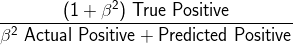
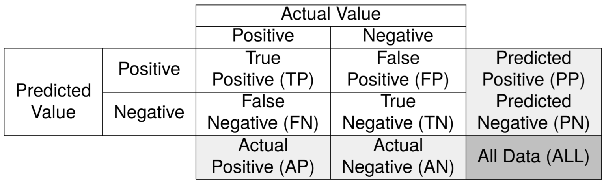
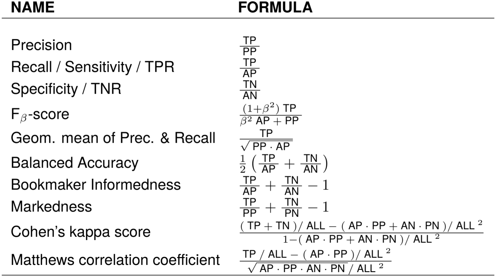
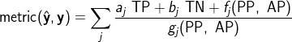

# AdversarialPrediction.jl

This package provides a way to easily optimize generic performance metrics in supervised learning settings using the [Adversarial Prediction](https://arxiv.org/abs/1812.07526) framework. 
The method can be integrated easily into differentiable learning pipelines.
The package is a Julia implementation of the paper ["AP-Perf: Incorporating Generic Performance Metrics in Differentiable Learning"]() by [Rizal Fathony](http://rizal.fathony.com) and [Zico Kolter](http://zicokolter.com). 
For a Python interface, please check  [ap-perf-py](https://github.com/rizalzaf/ap_perf_py).


## Overview

AdversarialPrediction.jl enables easily integration of generic performance metrics (including non-decomposable metrics) into our differentiable learning pipeline. It currently supports performance metrics that are defined over binary classification problems.
Below is a code example for incorporating the F-2 score metric into a convolutional neural network training pipeline of [FluxML](https://github.com/FluxML/Flux.jl). 

```julia
using Flux
using AdversarialPrediction
import AdversarialPrediction: define, constraint

model = Chain(
  Conv((5, 5), 1=>20, relu), MaxPool((2,2)),
  Conv((5, 5), 20=>50, relu), MaxPool((2,2)),
  x -> reshape(x, :, size(x, 4)),
  Dense(4*4*50, 500), Dense(500, 1), vec
)      

@metric FBeta beta
function define(::Type{FBeta}, C::ConfusionMatrix, beta)
    return ((1 + beta^2) * C.tp) / (beta^2 * C.ap + C.pp)  
end   
f2_score = FBeta(2)
special_case_positive!(f2_score)

objective(x, y) = ap_objective(model(x), y, f2_score)
Flux.train!(objective, params(model), train_set, ADAM(1e-3))
```

As we can see from the code above, we can just write a function that calculate the F-2 score from the entities in the confusion matrix, and incorporate it into our learning pipeline using `ap_objective` function. Note that the equation for F-beta in general is:   
<div style="text-align:center"></div>


## Installation

AdversarialPrediction.jl can be installed from a Julia terminal:
```
]add https://github.com/rizalzaf/AdversarialPrediction.jl
```
Some pre-requisite packages will be installed automatically: `JuMP`, `ECOS`, `Requires`, and `Flux`. Note that it requires `Flux v0.9` which uses `Tracker`-based autodifferentiation tool, rather than the newer `Zygote`-based tool. It will switches to `Zygote` in the future release.

We also recommend installing `Gurobi` separately. 
The inner optimization in the adversarial prediction framework requires solving LP problems. 
`Gurobi` will be used as the solver if it is loaded; otherwise `ECOS` solver will be used. 
We recommend `Gurobi` as the solver, since it is usually faster than `ECOS`.
For GPU training, `CuArrays` package needs to be installed.


## Performance Metrics

Different tasks in machine learning  require different metrics that align  well with the tasks. For binary classification problems, many of the commonly used performance metrics are derived from the confusion matrix. 
A confusion matrix is a table that reports the values that relate the prediction of a classifier with the ground truth labels. The table below shows the anatomy of a confusion matrix.

<div style="text-align:center"></div>

Some of the metrics are decomposable, which means that it can be broken down to an independent sum of another metric that depends only on a single sample. However, most of the interesting performance metrics are non-decomposable, where we need to consider all samples at once. There are a wide variety of non-decomposable performance metrics, for example:

<div style="text-align:center"></div>

AdversarialPrediction.jl supports a family of performance metrics that can be expressed as a sum of fractions:

<div style="text-align:center"></div>
 
where a<sub>j</sub> and b<sub>j</sub> are constants, whereas f<sub>j</sub> and g<sub>j</sub> are functions over PP and AP.
Hence, the numerator is a linear function over true positive (TP) and true negative (TN) which may also depends on sum statistics, i.e., predicted and actual positive (PP and AP) as well as their negative counterparts (predicted and actual negative (PN an AN)) and all data (ALL).
The denominator depends only on the sum statistics (PP, AP, PN, AN, and ALL). This construction of performance metrics covers a vast range of commonly used metrics, including all metrics in the table above.


## Defining Performance Metrics

A performance metric can be defined in AdversarialPrediction.jl using the macro `@metric MetricName`.  We also need to write the definition of the metric by implementing a function that depends on the type of the metric and the confusion matrix: `define(::Type{MetricName}, C::ConfusionMatrix)`. Below is an example of F-1 score metric definition.
```julia
@metric F1Score
function define(::Type{F1Score}, C::ConfusionMatrix)
    return (2 * C.tp) / (C.ap + C.pp)  
end 
```

Some performance metrics (e.g., precision, recall, F-score, sensitivity, and specificity) enforce special cases to avoid division by zero. For the metrics that contain true positive, the special case is usually defined when the prediction or the true label for every sample are all zero. In this case, the metric is usually defined as 1 if both the prediction and the true label are all zero; otherwise, the metric is 0. For the metrics that contain true negative, similar cases occur, but with the prediction or the true label for every sample are all one.
Therefore, when instantiating a metric, we need to take into account these special cases, for example, in the case of F-1 score:
```julia
f1_score = F1Score()
special_case_positive!(f1_score)
```

For some performance metrics, we may want to define a parametric metric. For example, the F-beta score, which depends on the value of beta. In this case, we can write a macro with arguments, for example, `@metric MetricName arg1 arg2`. We also need to adjust the function definition to: `define(::Type{MetricName}, C::ConfusionMatrix, arg1, arg2)`. For the case of the F-beta score metric, the code is:
```julia
@metric FBeta beta
function define(::Type{FBeta}, C::ConfusionMatrix, beta)
    return ((1 + beta^2) * C.tp) / (beta^2 * C.ap + C.pp)  
end   

f1_score = FBeta(1)
special_case_positive!(f1_score)

f2_score = FBeta(2)
special_case_positive!(f2_score)
```


We can define arbitrary complex performance metrics inside the `define` function, so long as it follows the construction of metrics that the package support. We can also use intermediate variables to store partial expression of the metric. Below is a code example for Cohen's kappa score.
```julia
@metric Kappa
function define(::Type{Kappa}, C::ConfusionMatrix)
    pe = (C.ap * C.pp + C.an * C.pn) / C.all^2
    num = (C.tp + C.tn) / C.all - pe
    den = 1 - pe
    return num / den
end  

kappa = Kappa()
special_case_positive!(kappa)
special_case_negative!(kappa)
```

## Performance Metric with Constraints 

In some machine learning settings, we may want to optimize a performance metric subject to constraints on other metrics. This occurs in the case where there are trade-offs between different performance metrics. For example, a machine learning system may want to optimize the precision of the prediction; subject to its recall is greater than some threshold. We can define the constraints in the metric by implementing the function: `constraint(::Type{MetricName}, C::ConfusionMatrix)`. The code format for the constraints is `metric >= th`, where `th` is a real-valued threshold. Below is an example:
```julia
# Precision given recall metric
@metric PrecisionGvRecall th
function define(::Type{PrecisionGvRecall}, C::ConfusionMatrix, th)
    return C.tp / C.pp
end   
function constraint(::Type{PrecisionGvRecall}, C::ConfusionMatrix, th)
    return C.tp / C.ap >= th
end   

precision_gv_recall_80 = PrecisionGvRecall(0.8)
special_case_positive!(precision_gv_recall_80)
cs_special_case_positive!(precision_gv_recall_80, true)

precision_gv_recall_60 = PrecisionGvRecall(0.6)
special_case_positive!(precision_gv_recall_60)
cs_special_case_positive!(precision_gv_recall_60, true)
```

Note that the function `special_case_positive!` enforces special cases for the precision metric, whereas `cs_special_case_positive!` enforces special cases for the metric in the constraint (recall metric).

We can also have two or more metrics in the constraints, for example:
```julia
# Precision given recall >= th1 and specificity >= th2
@metric PrecisionGvRecallSpecificity th1 th2        
function define(::Type{PrecisionGvRecallSpecificity}, C::ConfusionMatrix, th1, th2)
    return C.tp / C.pp
end   
function constraint(::Type{PrecisionGvRecallSpecificity}, C::ConfusionMatrix, th1, th2)
    return [C.tp / C.ap >= th1,
            C.tn / C.an >= th2]
end   

precision_gv_recall_spec = PrecisionGvRecallSpecificity(0.8, 0.8)
special_case_positive!(precision_gv_recall_spec)
cs_special_case_positive!(precision_gv_recall_spec, [true, false])
cs_special_case_negative!(precision_gv_recall_spec, [false, true])
```

Here, we need to provide an array of boolean for the function `cs_special_case_positive!` and `cs_special_case_negative!`.

## Computing the Values of the Metric

Given we have a prediction for each sample `yhat` and the true label `y`, we can call the function `compute_metric` to compute the value of the metric. Both `yhat` and `y` are vectors containing 0 or 1. 
```julia
julia> compute_metric(f1_score, yhat, y)
0.8f0
```  

For a metric with constraints, we can call the function `compute_constraints` to compute the value of every  metric in the constraints. For example:
```julia
julia> compute_constraints(precision_gv_recall_spec, yhat, y)
2-element Array{Float32,1}:
 0.6
 0.6
```  

## Incorporating the Metric into Differentiable Learning Pipeline

As we can see from the first code example, we can use the function `ap_objective` to incorporate the metrics we define into differentiable learning pipeline. 
This function provides objective and gradient information from the adversarial prediction formulation, which then be propagated to the previous layers.
This serves as a replacement to the standard loss function like the binary cross-entropy loss, i.e.: 
```julia
objective(x, y) = mean(logitbinarycrossentropy(model(x), y))
Flux.train!(objective, params(model), train_set, ADAM(1e-3))
```
We can easily replace the existing codes that use binary cross-entropy by simply change the objective to `ap_objective`, i.e.:
```julia
objective(x, y) = ap_objective(model(x), y, f1_score)
Flux.train!(objective, params(model), train_set, ADAM(1e-3))
```

The adversarial prediction formulation inside the function `ap_objective` needs to solve LP problems with a quadratic size of variables, i.e., O(n^2) where n is the number of samples in a batch. To keep the running time relatively fast, we suggest setting the batch size to be around 25 samples.   

## Customizing Linear Program Solver

For solving the inner LP problem, AdversarialPrediction.jl uses `JuMP` as the modeling framework and `Gurobi` as the default  solver if it is loaded in the environment. If `Gurobi` is not available, `ECOS` solver will be used. 
To use `Gurobi` as the default  solver, simply load the package before loading AdversarialPrediction.jl, i.e.:
```julia
using Gurobi
using AdversarialPrediction
import AdversarialPrediction: define, constraint
```

We can also manually set the solver using `JuMP`'s solver construction. Below are examples of manually setting the LP solver to `Mosek` and `ECOS`.

```julia
using JuMP, MosekTools
solver = JuMP.with_optimizer(Mosek.Optimizer, QUIET=true)
set_lp_solver!(f1_score, solver)
```

```julia
using JuMP, ECOS
solver = JuMP.with_optimizer(ECOS.Optimizer, verbose = false)
set_lp_solver!(f1_score, solver)
```

Please check [JuMP's website](https://github.com/JuliaOpt/JuMP.jl) for the list of supported solvers.


## Code Examples

For working examples, please visit [AP-examples](https://github.com/rizalzaf/AP-examples) repository. The project contains examples of using AdversarialPrediction.jl for image classification with MNIST and FashionMNIST datasets, as well as for classification with tabular data.

## Python Interface

We also provide a python interface to AdversarialPrediction.jl via [PyJulia](https://pyjulia.readthedocs.io/en/stable/) library. This enables easy integration with Python codes as well as PyTorch deep learning framework. Please visit [ap-perf-py](https://github.com/rizalzaf/ap_perf_py) for the details.

## Citation

Please cite the following papers if you use AdversarialPrediction.jl for your research.
```
@article{ap-perf,
  title={AP-Perf: Incorporating Generic Performance Metrics in Differentiable Learning},
  author={Fathony, Rizal and Kolter, Zico},
  journal={arXiv preprint arXiv:XXXX.XXXXX},
  year={2019}
}
```


## Acknowledgements

This project is supported by a grant from the [Bosch Center for Artificial Intelligence](https://www.bosch-ai.com/).

This project is not possible without previous foundational research in Adversarial Prediction by [Prof. Brian Ziebart's](https://www.cs.uic.edu/Ziebart) and [Prof. Xinhua Zhang's](https://www.cs.uic.edu/~zhangx/) research groups at the [University of Illinois at Chicago](https://www.cs.uic.edu).
